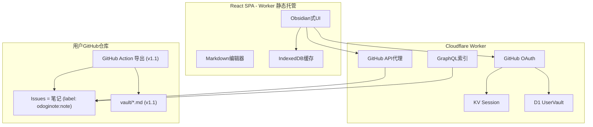
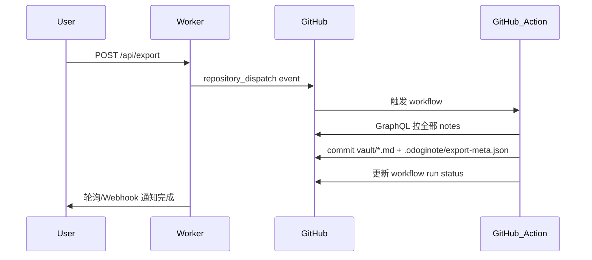
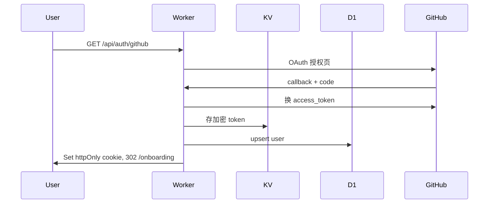

# odoginote MVP 实施计划（修订版）

## 产品定义

**一句话**：登录 GitHub → 选/建笔记仓库 → 每条笔记是一个 Issue → Obsidian 式 Web 编辑器 → 数据在用户 GitHub 仓库。

**MVP（v0，~7 天）**：登录、记笔记、分文件夹、标签、搜索、自动保存、归档。

**v1.1（+7 天）**：Wiki 链接、反向链接、每日笔记、GitHub Action 导出 `.md`。

**不做**：Obsidian 兼容、GitLab（Phase 2）、服务端存储笔记正文、关系图谱、PWA 离线。

---

## 修订要点（相对初版）

| 变更 | 原因 |
|------|------|
| 瘦身 MVP，导出/Wiki/反向链接延后 | 快上线 |
| **frontmatter 存 folder/tags**，不用 folder Label | 避开 GitHub 100 Label 上限 |
| **GraphQL** 做全库索引 | 减少 REST 请求，为 v1.1 链接功能打基础 |
| **导出改 GitHub Action**，不在 Worker 跑 | 避免 Worker CPU/超时限制 |
| **D1** 存用户配置，KV 只存 session | 结构化查询 + session 分离 |
| **Worker 同时 serve 静态前端 + API** | 一次 deploy，更少运维 |
| 过滤 PR、**updated_at 并发检测** | 避免 Issues API 隐性 bug |

---

## 架构总览



**零运维要点**：无自建 DB 服务（D1 为 Cloudflare 内置 SQLite）；笔记正文 100% 在用户 GitHub Issue；token 不暴露给前端。

---

## 数据模型：Issue + Frontmatter

每条 odoginote 笔记 = 一个 GitHub Issue，带系统 Label `odoginote:note`（用于与普通 Issue/PR 区分）。

Issue `body` 结构：

```markdown
---
folder: projects/odoginote
tags: [idea, draft]
---

正文 Markdown 从这里开始...
```

| 概念 | 实现 |
|------|------|
| 笔记标题 | Issue `title` |
| 笔记正文 | Issue `body` 中 frontmatter 以下的内容 |
| 文件夹 | frontmatter `folder`（如 `inbox`、`projects/odoginote`） |
| 标签 | frontmatter `tags: [...]` |
| 每日笔记 (v1.1) | frontmatter `daily: 2026-06-14` + 固定标题 |
| 归档 | Issue `state: closed` |
| 稳定 ID | Issue number `#123` |
| 系统标记 | Label `odoginote:note`（建仓时创建，仅 1 个 Label） |

**文件夹树**：GraphQL 拉取所有 `odoginote:note` Issue → 解析 frontmatter.folder → 前端组装树。不占用 Label 配额。

约定文档：[docs/conventions.md](docs/conventions.md)

---

## GitHub API 策略

| 场景 | API | 说明 |
|------|-----|------|
| 列表/CRUD | REST Issues API | 过滤 `pull_request` 字段（排除 PR） |
| 全库索引/搜索 | GraphQL | 一次拉多条 `title body updatedAt labels` |
| 并发检测 | REST PATCH | 请求带 `If-Match` 或比对 `updated_at` |
| 导出 (v1.1) | GitHub Action | Worker 发 `repository_dispatch` 触发 |

GraphQL 示例（Worker 端）：

```graphql
query NotesIndex($owner: String!, $repo: String!, $cursor: String) {
  repository(owner: $owner, name: $repo) {
    issues(first: 50, after: $cursor, labels: ["odoginote:note"], states: [OPEN, CLOSED]) {
      pageInfo { hasNextPage endCursor }
      nodes { number title body updatedAt state }
    }
  }
}
```

---

## 混合导出（v1.1，GitHub Action）

MVP **不做导出**。v1.1 实现：



建仓时写入模板：[`.github/workflows/odoginote-export.yml`](.github/workflows/odoginote-export.yml)

导出文件格式：

```yaml
---
title: "笔记标题"
issue: 123
folder: projects/odoginote
tags: [idea]
created: 2026-06-14T10:00:00Z
updated: 2026-06-14T12:00:00Z
---

正文...
```

路径：`vault/{folder}/{slug}.md`（无 folder → `vault/inbox/`）

---

## 功能范围

### MVP v0（必做，~7 天）

| 功能 | 实现 |
|------|------|
| GitHub OAuth 登录 | OAuth App + httpOnly cookie |
| 选/建笔记仓库 | Onboarding 向导 |
| Issue 新建/编辑/归档 | REST API 代理 |
| 分屏 Markdown 编辑 + 预览 | CodeMirror 6 + react-markdown |
| 文件夹树 | frontmatter.folder 解析 |
| 标签 | frontmatter.tags，UI 标签栏 |
| 笔记列表 + 搜索 | GraphQL 索引 + 客户端 filter |
| 自动保存 | debounce 2s + updated_at 冲突提示 |
| 移动端 | 三栏 → 单栏抽屉切换 |
| 图片附件 (基础) | 上传到 repo `vault/assets/`  via Contents API，正文引用相对路径 |

### v1.1（+7 天）

| 功能 | 实现 |
|------|------|
| Wiki 链接 `[[标题]]` | 客户端索引 + 点击跳转 |
| 反向链接 | 全库扫描 `[[...]]`，IndexedDB 缓存 |
| 每日笔记 | frontmatter.daily + 快捷按钮 |
| 导出到 vault/*.md | GitHub Action |
| 导出状态 UI | 轮询 workflow run |

### Phase 2（更远）

- GitLab OAuth + Issues API（抽象 `GitProvider` interface）
- GitHub App 替代 OAuth App（细粒度权限、更高 rate limit）
- 关系图谱、PWA 离线、定时自动导出
- 团队协作（repo 权限即协作权限）

---

## 技术栈

| 层 | 选型 | 理由 |
|----|------|------|
| 前端 | React 19 + Vite + TypeScript | 生态成熟 |
| UI | Tailwind + shadcn/ui | 快速搭 Obsidian 暗色布局 |
| 编辑器 | CodeMirror 6 | 轻量、Markdown 友好 |
| API | Cloudflare Worker + Hono | 静态资源 + `/api/*` 合一 |
| Session | Workers KV | 加密 token + session id |
| 用户配置 | D1 (SQLite) | users, vaults 表 |
| 前端缓存 | IndexedDB | 笔记索引、离线只读基础 |
| Monorepo | pnpm workspace | apps/web + apps/worker + packages/shared |

---

## 项目结构

```
odoginote/
├── apps/
│   ├── web/                        # React SPA（build 产物由 Worker serve）
│   │   └── src/
│   │       ├── components/         # Editor, Sidebar, NoteList, TagBar, MobileDrawer
│   │       ├── hooks/                # useNotes, useFrontmatter
│   │       └── pages/                # Login, Onboarding, Vault
│   └── worker/
│       ├── src/
│       │   ├── index.ts              # Hono：/api/* + serveStatic
│       │   ├── routes/
│       │   │   ├── auth.ts
│       │   │   ├── notes.ts
│       │   │   └── export.ts         # v1.1: repository_dispatch
│       │   └── lib/
│       │       ├── github-rest.ts
│       │       ├── github-graphql.ts
│       │       ├── session.ts        # KV
│       │       └── db.ts             # D1
│       ├── migrations/
│       │   └── 0001_init.sql
│       └── wrangler.toml
├── packages/
│   └── shared/
│       └── src/
│           ├── frontmatter.ts        # 解析/序列化 YAML frontmatter
│           ├── folder-tree.ts        # folder 路径 → 树结构
│           └── types.ts
├── templates/
│   └── odoginote-export.yml          # 建仓时写入用户 repo (v1.1)
├── docs/
│   └── conventions.md
└── package.json
```

---

## D1 Schema

```sql
CREATE TABLE users (
  id            TEXT PRIMARY KEY,  -- GitHub user id
  login         TEXT NOT NULL,
  created_at    TEXT NOT NULL
);

CREATE TABLE vaults (
  user_id       TEXT PRIMARY KEY REFERENCES users(id),
  owner         TEXT NOT NULL,
  repo          TEXT NOT NULL,
  created_at    TEXT NOT NULL
);
```

Token 存 KV：`session:{sessionId}` → `{ userId, encryptedToken, expiresAt }`

---

## 认证流程



**OAuth App**（平台运营者创建一次，服务所有用户）：
- Callback: `https://odoginote.dev/api/auth/callback`
- Scopes: `read:user`, `repo`
- Onboarding 文案强调：「仅访问你选定的笔记仓库」
- Phase 2 升级 GitHub App，scope 收窄为 Issues 读写

---

## 核心 API 路由

| 方法 | 路径 | MVP | 作用 |
|------|------|-----|------|
| GET | `/api/auth/github` | v0 | 发起 OAuth |
| GET | `/api/auth/callback` | v0 | 回调 |
| GET | `/api/auth/logout` | v0 | 清除 session |
| GET | `/api/user` | v0 | 当前用户 + vault 信息 |
| GET | `/api/repos` | v0 | 列仓库（onboarding） |
| POST | `/api/repos/setup` | v0 | 建仓/绑仓 + 初始化 |
| GET | `/api/notes` | v0 | 列表（分页、folder/state 过滤） |
| GET | `/api/notes/:number` | v0 | 单条 |
| POST | `/api/notes` | v0 | 新建 Issue |
| PATCH | `/api/notes/:number` | v0 | 更新（含 updated_at 校验） |
| POST | `/api/notes/:number/upload` | v0 | 图片上传到 vault/assets/ |
| GET | `/api/notes/index` | v0 | GraphQL 全库索引 |
| POST | `/api/export` | v1.1 | 触发 GitHub Action 导出 |

---

## Onboarding 流程

1. GitHub 登录
2. 选择：
   - **新建** `{username}/odoginote` 私有仓库
   - **绑定** 已有仓库
3. 初始化 repo：
   - 创建 Label `odoginote:note`
   - 写入 `README.md`（说明 + 快速开始）
   - 创建欢迎 Issue（示例 frontmatter + 正文）
   - v1.1：写入 `.github/workflows/odoginote-export.yml`
4. D1 写入 vault 绑定
5. 进入主界面

---

## UI 布局

**桌面（三栏）**：

```
┌──────────┬─────────────┬─────────────────────────────┐
│ 文件夹树  │  笔记列表    │  标题 + 保存状态              │
│ inbox    │  > 笔记 A   │  [编辑区]  │  [预览区]         │
│ projects │    笔记 B   │  标签: #idea #draft          │
│ + 新建    │  🔍 搜索    │                              │
└──────────┴─────────────┴─────────────────────────────┘
顶栏：搜索 | 新建笔记 | 设置 | 退出
```

**移动（单栏 + 抽屉）**：默认编辑器全屏，左滑出文件夹/列表抽屉。

暗色主题默认：`#1e1e1e` 背景、`#7c3aed` accent。

v1.1 顶栏增加：每日笔记 | 导出到仓库 | 反向链接面板。

---

## 关键实现细节

### Frontmatter 读写

`packages/shared/src/frontmatter.ts`：
- 解析：从 Issue body 提取 `---` 块 → `{ folder, tags, daily? }` + 正文
- 写入：编辑 folder/tags 时重写 frontmatter，PATCH Issue body
- 编辑器只展示/编辑正文部分；folder/tags 由 UI 控件管理

### 自动保存与并发

- debounce **2s**（减少 Issue 编辑历史噪音）
- PATCH 时带 `expectedUpdatedAt`；若 GitHub 返回的 `updated_at` 更新，返回 409 + 提示「已在其他窗口修改」
- UI 显示：保存中 / 已保存 / 冲突

### 图片附件

1. 用户粘贴/上传图片
2. Worker 调用 Contents API：`vault/assets/{uuid}.{ext}`
3. 编辑器插入 ``
4. MVP 不做 Issue 原生附件 API（不可控且难同步）

### Rate Limit 防护

- GraphQL 索引结果缓存 60s（Worker Cache API + IndexedDB）
- 列表分页，每页 30 条
- Worker 统一处理 403/429，返回 Retry-After 提示

---

## 实施阶段

### Week 1 — MVP v0（~7 天）

| 天 | 任务 |
|----|------|
| 1-2 | Monorepo + Worker serve 静态 + OAuth + KV/D1 |
| 3 | Onboarding + Issue CRUD + PR 过滤 + frontmatter |
| 4-5 | 三栏 UI + 编辑器/预览 + 文件夹/标签 + 自动保存 |
| 6 | 搜索 + GraphQL 索引 + 图片上传 + 移动布局 |
| 7 | 部署 + 隐私页 + 空状态/错误处理 |

### Week 2 — v1.1（~7 天）

| 天 | 任务 |
|----|------|
| 1-2 | Wiki 链接 + 反向链接索引 |
| 3 | 每日笔记 |
| 4-5 | GitHub Action 导出模板 + repository_dispatch + 状态 UI |
| 6-7 | polish + 边界测试（大仓库、并发、rate limit） |

---

## 风险与对策

| 风险 | 对策 |
|------|------|
| Issue 量大，列表慢 | GraphQL 分页 + IndexedDB 本地索引 |
| GitHub rate limit | 缓存 + debounce + 索引增量更新 |
| Worker 导出超时 | **不在 Worker 导出**，改 GitHub Action |
| frontmatter 被用户手动改乱 | 解析容错 + UI 重写 frontmatter |
| OAuth `repo` scope 用户顾虑 | onboarding 说明 + Phase 2 GitHub App |
| Issues API 混入 PR | 过滤 `pull_request` 字段 |
| 多端编辑冲突 | updated_at 检测 + 409 提示 |

---

## 环境变量

```
GITHUB_CLIENT_ID=
GITHUB_CLIENT_SECRET=
SESSION_SECRET=
```

Wrangler bindings：`KV_SESSION`, `D1_DB`

本地开发：`pnpm dev` → Vite HMR + wrangler dev proxy `/api`。

---

## 上线清单

1. GitHub 创建 OAuth App，填入 Wrangler secrets
2. 创建 D1 database，`wrangler d1 migrations apply`
3. `pnpm build && wrangler deploy`
4. 配置自定义域名（可选）
5. 上线隐私页：「笔记存在你的 GitHub 仓库 Issue 中，我们不存储笔记内容；token 加密存于 Cloudflare KV」
