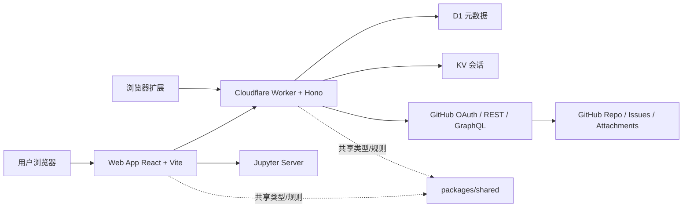
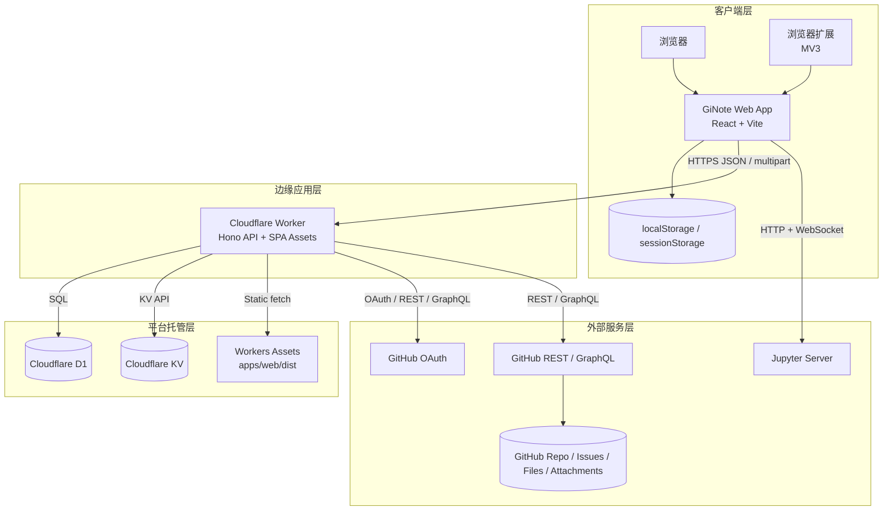
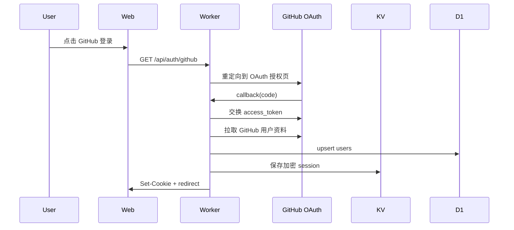
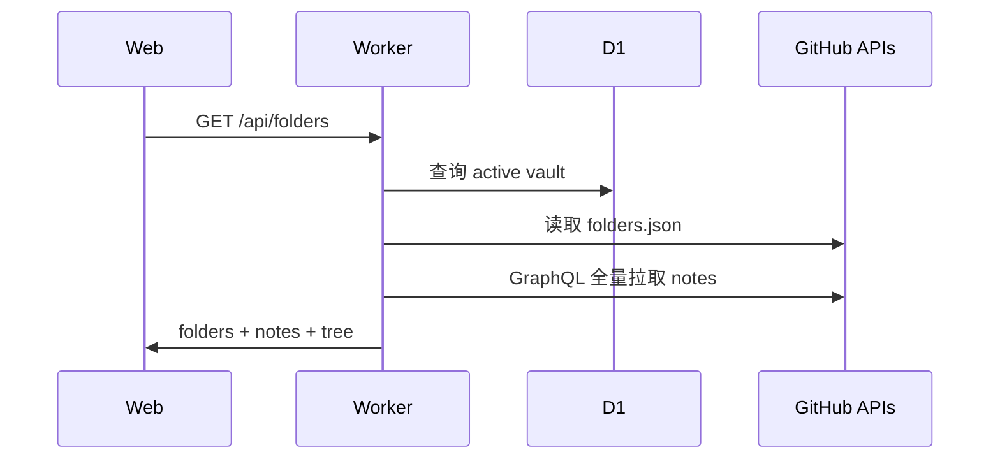
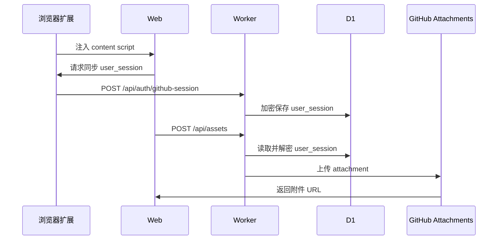
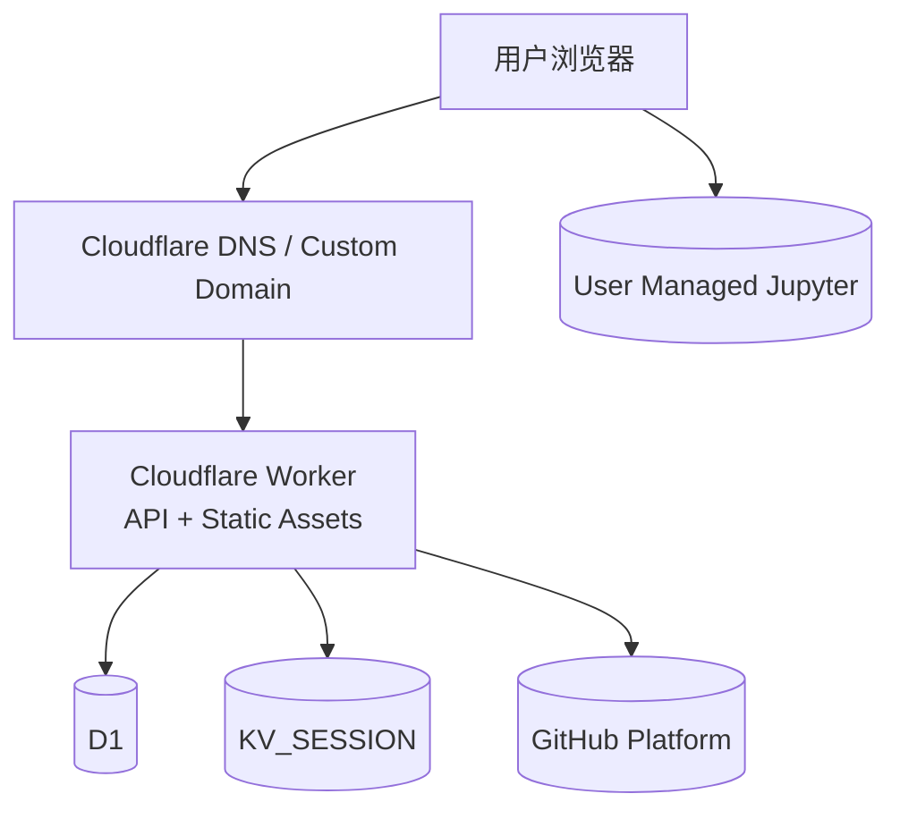
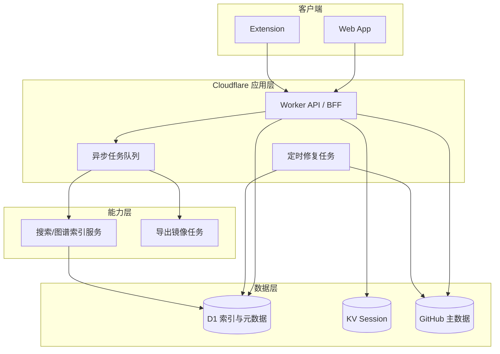

# GiNote 产品架构分析报告

> 基于当前仓库代码、配置与文档的静态分析  
> 分析日期：2026-06-30

## 1. 执行摘要

GiNote 当前采用典型的轻量无服务器架构：

- 前端为 `apps/web`，技术栈为 React 19 + Vite。
- 后端为 `apps/worker`，运行在 Cloudflare Workers 上，使用 Hono 提供 API，并同时托管前端静态资源。
- 服务端状态拆分为 Cloudflare D1 与 KV：D1 保存用户、Vault、加密后的 GitHub `user_session`，KV 保存登录会话。
- 核心业务数据并不落在自建数据库中，而是以 GitHub Repository + Issues + Repo Files 的形式保存。
- 附件支持两种模式：GitHub user-attachments 或仓库内文件。
- 浏览器扩展用于同步 GitHub `user_session`，支撑附件上传与受限资源预览。
- Notebook 能力并不在后端执行，而是浏览器直接连接用户自有的 Jupyter Server。

整体来看，这套架构在 MVP 和个人产品阶段具备明显优势：交付快、运维轻、成本低、数据主权强。但随着数据量增长和能力扩展，架构问题也较为明确：

- 读路径高度依赖 GitHub API 全量扫描，性能与扩展性会率先遇到瓶颈。
- 领域模型与 GitHub 存储模型耦合过深，导致后续引入本地文件、对象存储、搜索索引或协作能力的改造成本较高。
- 关键安全链路存在缺口，OAuth 登录未见 `state` 校验。
- 部署层虽简洁，但缺少环境分层、基础设施即代码、显式备份恢复方案与标准化发布流水线。

## 2. 产品核心业务模块梳理

### 2.1 模块划分总览

| 模块 | 主要位置 | 核心职责 | 上游依赖 | 下游依赖 |
|------|----------|----------|----------|----------|
| 认证与会话 | `apps/worker/src/routes/auth.ts` | GitHub OAuth 登录、登出、会话管理、用户资料查询 | GitHub OAuth、KV、D1 | Web 前端、浏览器 Cookie |
| Vault 管理 | `apps/worker/src/routes/vaults.ts` | 创建/绑定仓库、切换 Vault、初始化仓库结构 | GitHub Repo API、GraphQL、D1 | Web 前端 |
| 笔记管理 | `apps/worker/src/routes/notes.ts` | 笔记 CRUD、图谱、搜索过滤、归档 | GitHub Issues API、GraphQL | Web 前端 |
| 文件夹管理 | `apps/worker/src/routes/folders.ts` | 管理 `.odoginote/folders.json`，构建文件树 | GitHub Repo Contents API、GraphQL | Web 前端 |
| 资源与图片 | `apps/worker/src/routes/assets.ts` | 上传图片、附件代理、仓库图片读取 | GitHub Repo API、GitHub user-attachments、D1 | Web 前端、扩展 |
| 导出镜像 | `apps/worker/src/routes/export.ts` | 将 Vault 导出为 Markdown 与镜像文件 | GitHub API、D1 中的加密 session | Web 前端 |
| Web 应用壳层 | `apps/web/src/layout/AppShell.tsx` | 页面布局、侧栏、标签、快捷键、模态框编排 | VaultProvider、本地设置 | 用户交互层 |
| Vault 状态编排 | `apps/web/src/features/vault/VaultProvider.tsx` | 加载笔记树、当前笔记、创建/归档/导出/今日笔记等高阶操作 | `api.ts`、共享包 | AppShell、面板、编辑器 |
| 编辑器子系统 | `apps/web/src/components/NoteEditor.tsx` 等 | Markdown / Todo / Excalidraw / Notebook 编辑与保存 | VaultProvider、共享包、图片 API、Jupyter | 用户 |
| 发现与导航 | `apps/web/src/panels/*` | 文件树、搜索、标签、图谱、待办聚合、大纲、反链、出链 | Notes API、Vault 状态 | 用户 |
| 浏览器扩展 | `apps/extension/*` | 读取 GitHub `user_session` Cookie 并同步到产品 | Chrome Extension API、Web API | Worker `/api/auth/github-session` |
| 共享领域层 | `packages/shared/src/*` | 共享类型、frontmatter、图谱、文件树、Todo/Notebook/Excalidraw 序列化 | 无 | Web、Worker |

### 2.2 模块职责边界

#### 1. Web 前端

- 负责交互、布局、编辑体验、本地设置与临时状态。
- 不直接访问 GitHub；统一通过 Worker API 访问业务数据。
- Notebook 例外：浏览器直接通过 HTTP/WebSocket 访问 Jupyter。

#### 2. Worker API

- 负责鉴权、Vault 选择、GitHub API 编排、D1/KV 数据访问与静态资源托管。
- 不直接存储笔记正文，仅将 GitHub Issues/Repo Files 适配为产品领域模型。
- 本质是“BFF + 轻量领域适配层”。

#### 3. D1 / KV

- D1 只承担“元数据存储”职责，不保存笔记正文。
- KV 只承担“登录会话缓存/持久化”职责。
- 两者都不是产品知识内容的主存储。

#### 4. GitHub

- GitHub Repo 是实际 Vault 载体。
- GitHub Issues 是笔记主存储。
- Repo Files 承担配置、文件夹、导出镜像、仓库图片等对象存储职责。
- GitHub 同时承担 OAuth 身份源与 API 平台角色。

### 2.3 模块间依赖与调用关系

## 3. 完整技术架构梳理

### 3.1 前端架构

#### 技术栈

- UI 框架：React 19
- 构建工具：Vite 6
- 路由：React Router 7
- Markdown 渲染：`react-markdown` + `remark-gfm`
- 图表/绘图：Mermaid、Excalidraw
- Notebook：自定义 notebook editor + Jupyter 协议适配
- 本地状态：React hooks + `localStorage` + `sessionStorage`

#### 前端分层

| 层级 | 目录 | 说明 |
|------|------|------|
| 应用入口层 | `App.tsx`、`main.tsx` | 登录态判断、路由入口 |
| 页面与壳层 | `pages/*`、`layout/*` | Onboarding、Vault 页面与整体布局 |
| 领域状态层 | `features/vault/*`、`hooks/*` | Vault 状态、快捷键、标签页、设置 |
| 编辑器层 | `components/NoteEditor.tsx`、`features/editor/*` | 自动保存、Markdown 编辑、结构化笔记编辑 |
| 发现层 | `panels/*` | 文件树、搜索、图谱、标签、Todo |
| 基础设施层 | `lib/api.ts`、`lib/*` | API 调用、图片 URL 转换、Jupyter 连接等 |

### 3.2 后端架构

#### 技术栈

- 运行时：Cloudflare Workers
- Web 框架：Hono
- 数据库：Cloudflare D1
- 会话存储：Cloudflare KV
- 静态资源托管：Workers Assets

#### 后端路由分层

| 路由 | 职责 | 关键依赖 |
|------|------|----------|
| `/api/auth/*` | GitHub OAuth、登录态、GitHub `user_session` 管理 | GitHub OAuth、KV、D1 |
| `/api/vaults/*` | 仓库创建/绑定/切换 | GitHub REST/GraphQL、D1 |
| `/api/folders/*` | 文件夹文件读写、文件树返回 | GitHub Contents API |
| `/api/notes/*` | 笔记增删改查、图谱、搜索 | GitHub Issues/GraphQL |
| `/api/assets/*` | 图片上传、图片代理、仓库图片访问 | GitHub attachments、Repo files、D1 |
| `/api/export` | 导出镜像 | GitHub API、D1 |
| `*` | SPA 静态资源回退 | Workers Assets |

### 3.3 数据架构

#### 数据存储分工

| 数据类型 | 实际存储位置 | 说明 |
|----------|--------------|------|
| 用户信息 | D1 `users` | login、avatar、active vault、加密 session |
| Vault 元数据 | D1 `user_vaults` | owner/repo、多 Vault、最近打开时间 |
| 登录会话 | KV | 加密后的 OAuth token 与用户 ID |
| 笔记正文 | GitHub Issues body | Markdown / Notebook / Excalidraw / Todo 内容 |
| 笔记元数据 | GitHub Issue body frontmatter | folder、tags、daily、type |
| 文件夹结构 | GitHub Repo `.odoginote/folders.json` | 逻辑文件夹索引 |
| 仓库初始化标记 | GitHub Repo `.odoginote/config.json` | Vault 初始化状态 |
| 仓库模式图片 | GitHub Repo `assets/*` | 二进制文件 |
| GitHub 附件模式图片 | GitHub user-attachments | 外部附件 URL |
| 前端设置 | 浏览器 local/session storage | 主题、布局、标签页等 |

### 3.4 第三方服务与协议

| 外部系统 | 作用 | 交互协议 |
|----------|------|----------|
| GitHub OAuth | 用户登录授权 | HTTPS OAuth 2.0 |
| GitHub REST API | Repo、Issue、Contents、Repo 查询 | HTTPS JSON |
| GitHub GraphQL API | 批量拉取笔记索引 | HTTPS GraphQL |
| GitHub user-attachments | 图片附件上传与访问 | HTTPS multipart / binary |
| Jupyter Server | Notebook 执行 | HTTP REST + WebSocket |
| Chrome/Edge Extension API | Cookie 读取与页面消息通信 | Extension APIs + `window.postMessage` |

### 3.5 技术架构图

### 3.6 核心数据流

#### 1. 登录流

#### 2. 笔记读取流

#### 3. 图片附件流

## 4. 部署架构梳理

### 4.1 当前实际部署形态

根据 `wrangler.jsonc`、README 与部署文档，当前生产部署形态如下：

- 单个 Cloudflare Worker 服务：名称 `odoginote`
- 自定义域名：`ginote.yekai.ltd`
- Workers 备用域名：`odoginote.jellyyekai.workers.dev`
- 静态资源目录：`apps/web/dist`
- D1 数据库：`odoginote-db`
- KV 命名空间：`KV_SESSION`
- Secrets：`GITHUB_CLIENT_ID`、`GITHUB_CLIENT_SECRET`、`SESSION_SECRET`

### 4.2 部署架构图

### 4.3 服务器集群、容器化、网络拓扑、容灾现状

#### 1. 服务器集群配置

- 当前没有传统意义上的 ECS/VM/K8s 服务器集群。
- 计算资源完全由 Cloudflare Workers 托管和弹性扩缩。
- 因此“集群配置”更多体现为 Cloudflare 平台级高可用，而不是项目自主管理的节点编排。

#### 2. 容器化部署方案

- 当前仓库中未发现 `Dockerfile`、`docker-compose`、Kubernetes 配置或镜像流水线。
- 说明当前产品不采用容器化部署，而是直接使用 `wrangler deploy` 发布到 Workers。
- 这种方式对当前阶段是合理的，但不满足传统企业交付规范中对镜像、环境一致性和回滚链路的要求。

#### 3. 网络拓扑

- 外网入口统一为 Cloudflare 域名。
- 浏览器对 Worker 的业务请求走 HTTPS。
- Worker 对 GitHub API 发起外呼。
- Notebook 执行不走 Worker，而是浏览器直接连 Jupyter Server，意味着该链路受用户本地网络、CORS 与 WebSocket 可达性影响。

#### 4. 容灾与备份机制

现有架构天然具备部分“弱容灾”能力，但缺少完整的工程化方案：

- 笔记主数据在 GitHub，天然具备仓库级历史与版本追溯。
- 前端静态资源与后端运行托管在 Cloudflare，平台具备基础高可用。
- D1 与 KV 作为元数据与会话存储，仓库中未见明确备份、恢复、跨环境复制或定期校验机制。
- 导出能力可将笔记镜像回仓库文件，但更偏产品功能，不等同于平台级灾备。

## 5. 架构合理性评估

### 5.1 当前架构的优点

#### 1. 成本与交付效率高

- 无自建服务器、无容器编排、无复杂中间件。
- 用 Cloudflare Worker 同时承载 API 与静态站点，交付链路非常短。

#### 2. 数据主权清晰

- 核心内容直接落在用户 GitHub 仓库，降低平台锁定。
- 对知识型产品而言，可信度和可迁移性较强。

#### 3. 模块职责总体清晰

- 前端负责体验，Worker 负责适配与鉴权，GitHub 负责主数据。
- `packages/shared` 作为共享领域包，减少前后端重复规则。

#### 4. 平台选型与产品定位匹配

- 个人知识库 + GitHub 数据托管的产品定位，与 Cloudflare + GitHub 的轻架构非常匹配。

### 5.2 主要问题诊断

#### P1. 读路径依赖 GitHub 全量扫描，扩展性风险最高

表现：

- `/api/folders`、`/api/notes/index`、`/api/notes/graph`、导出流程等均依赖 `fetchAllNotes()`。
- `fetchAllNotes()` 每次通过 GraphQL 分页拉取所有笔记，再在 Worker 内解析 frontmatter。
- 前端 `VaultProvider.loadTree()` 在初始化、创建笔记、归档、Todo 勾选等多个动作后频繁触发。

影响：

- 笔记数量增大后，列表、搜索、图谱、文件树等功能会共同退化。
- GitHub API rate limit 与响应时间会直接成为产品性能上限。
- 单次请求成本与延迟随数据量线性增长。

结论：

- 当前架构适合中小规模个人知识库，不适合大规模 Vault、团队协作或高频搜索场景。

#### P2. 领域模型与 GitHub 存储模型耦合过深

表现：

- 笔记、文件夹、标签、导出、图片等能力都直接围绕 GitHub Issues / Repo Contents 设计。
- Worker 路由层直接编排 GitHub REST/GraphQL，缺少独立仓储接口或领域服务抽象。
- frontmatter 解析和 GitHub API 细节已渗透到多数核心路径。

影响：

- 后续若要新增本地文件模式、对象存储、全文索引或多后端存储，改造面会非常大。
- 测试替身与演进空间受限，业务规则与外部平台实现难以分离。

#### P3. 前端 `VaultProvider` 承担过多职责，状态耦合偏高

表现：

- `VaultProvider` 同时承担加载树、当前笔记、创建、归档、导出、今日笔记、Todo 勾选、Tab 联动等多类职责。
- 布局层 `AppShell` 与业务操作耦合较深。

影响：

- 前端复杂度继续增长时，状态追踪、测试与局部重构成本会上升。
- 不利于后续拆分为更稳定的领域服务、查询层和命令层。

#### P4. 搜索、图谱、标签等“发现能力”缺少独立索引层

表现：

- 搜索不是基于索引，而是基于全量拉取后的内存过滤。
- 图谱构建也依赖全量笔记扫描。
- 标签面板、Todo 聚合等衍生视图依赖同一份全量数据。

影响：

- 发现类功能会比编辑类功能更早遇到性能瓶颈。
- 一旦未来需要模糊搜索、排序、推荐、统计分析，现有结构难以支撑。

#### P5. 登录安全链路存在明显缺口

表现：

- GitHub OAuth 发起授权时未见 `state` 参数生成与回调校验。
- 会话 Cookie 未见按环境显式附加 `Secure` 属性。

影响：

- OAuth 登录链路抗 CSRF 能力不足。
- 在生产环境下仍建议显式强化 Cookie 安全策略。

#### P6. 乐观锁冲突检测是“近似校验”，不是原子一致性保证

表现：

- 更新笔记时，`updateIssue()` 先 `getIssue()` 比较 `updated_at`，再发起 `PATCH`。
- 校验与写入不是同一个原子操作。

影响：

- 在并发较高或跨设备频繁编辑场景中，仍存在竞争窗口。
- 当前实现更适合作为提示机制，而非严格一致性控制。

#### P7. 部署工程化能力偏弱

表现：

- 没有发现 CI/CD workflow、环境矩阵、IaC、自动化回滚或发布审批链路。
- 容灾更多依赖 GitHub 与 Cloudflare 平台自身能力，而非项目级方案。

影响：

- 随着多人协作或生产变更频率上升，发布可靠性与可追溯性不足。

#### P8. Notebook 执行链路绕过后端，用户环境依赖强

表现：

- Jupyter 连接由浏览器直接访问用户配置的 Jupyter Server。
- 需要处理本地服务可达性、CORS、Token、WebSocket 等问题。

影响：

- 该能力虽然解耦了 Worker 计算成本，但可用性严重依赖用户本地环境。
- 企业网络、远程设备、移动端等场景下使用门槛较高。

#### P9. 仓库根目录存在未纳入当前产品架构的 Next.js 残留脚手架

表现：

- 仓库根目录仍保留 `src/app/page.tsx` 与 `next.config.ts` 的默认 Next.js 脚手架文件。
- 当前实际运行应用并不是该 Next.js 工程，而是 `apps/web` + `apps/worker`。

影响：

- 容易误导新成员对系统边界的理解。
- 增加仓库噪音与维护成本。

## 6. 架构优化建议

### 6.1 短期优化（1-2 个版本）

#### 1. 为笔记建立增量索引或快照缓存

- 在 D1 中引入 `note_index` 表，缓存 note number、title、folder、tags、updatedAt、type、state、wiki links 等摘要信息。
- 新建/更新/归档笔记时同步更新索引，而不是每次全量从 GitHub 重建。
- 搜索、图谱、标签、Todo 聚合、文件树优先基于索引层返回。

预期收益：

- 明显降低 GitHub API 调用次数与首屏延迟。
- 为后续全文检索与统计分析打基础。

#### 2. 抽象存储仓储接口

- 在 Worker 中新增 `NoteRepository`、`FolderRepository`、`AssetRepository` 抽象。
- 让 GitHub 成为其中一种实现，而不是默认渗透到每个 route。

预期收益：

- 降低 GitHub 强耦合。
- 为未来支持本地文件、R2、D1 索引混合存储提供演进空间。

#### 3. 修复 OAuth 安全链路

- 增加 `state` 生成、存储、回调校验。
- 生产环境 Cookie 加 `Secure`，视需要补充 `SameSite` 策略审查。

预期收益：

- 补齐关键安全短板。

#### 4. 拆分前端大状态容器

- 将 `VaultProvider` 拆分为：
  - 查询层：`useVaultQuery`
  - 写操作层：`useVaultCommands`
  - 当前笔记会话层：`useActiveNoteSession`
  - 导出与今日笔记等辅助操作层

预期收益：

- 提升可维护性与可测试性。

#### 5. 清理无效脚手架与补全文档

- 删除或迁移根目录 Next.js 残留文件。
- 在架构文档中明确“当前主应用入口仅为 `apps/web` 与 `apps/worker`”。

### 6.2 中期优化（2-4 个版本）

#### 1. 构建“GitHub 为主存，D1 为索引”的双层架构

- GitHub 继续作为权威主数据源。
- D1 维护结构化索引、反链关系、标签统计、搜索辅助字段。
- 使用定时任务或事件驱动做索引修复与补偿。

#### 2. 引入异步任务链路

- 将导出、附件镜像、索引重建等重任务改为异步执行。
- 可引入 Cloudflare Queues / Workflows 处理长链路任务。

#### 3. 完善可观测性

- 增加 API 请求耗时、GitHub API 调用量、失败率、429 次数、D1/KV 调用错误等指标。
- 对关键路径增加结构化日志与错误码。

#### 4. 强化部署工程化

- 增加 GitHub Actions 或其他流水线。
- 将 D1/KV/域名/Secrets 配置纳入 IaC 或至少环境清单。
- 建立 staging / production 双环境。

### 6.3 长期优化（面向产品升级）

#### 1. 搜索与图谱独立化

- 若产品继续升级，可引入专门的搜索/图谱索引能力。
- 例如将全文检索、反链计算、标签聚合从“请求时计算”升级为“写时构建”。

#### 2. 协作能力前置设计

- 若未来支持评论、共享、协作编辑，需要重新定义一致性模型。
- GitHub Issue 方案适合单用户知识库，但不天然适合实时协作。

#### 3. Notebook 能力产品化重构

- 可选方向一：继续保留用户自带 Jupyter 的 BYO 模式。
- 可选方向二：由平台托管沙箱或内核服务，统一执行环境与权限控制。

## 7. 建议中的目标架构

## 8. 结论

GiNote 当前架构对于个人知识库产品是“方向正确、实现务实”的：

- 它很好地服务了“Obsidian 风格 Web 化 + 数据留在用户 GitHub”这一产品定位。
- Cloudflare Worker + GitHub 的组合让系统在成本、上线速度和维护复杂度之间取得了很好的平衡。

但从架构成熟度看，当前版本仍明显处在“单产品快速演进阶段”，主要挑战集中在四点：

- 全量拉取导致的性能与扩展性瓶颈；
- GitHub 存储模型带来的高耦合；
- OAuth 与会话策略上的安全硬化不足；
- 部署、备份、环境与发布链路的工程化欠缺。

建议后续演进遵循以下主线：

1. 保持 GitHub 作为主数据源不变；
2. 尽快补上 D1 索引层与异步任务层；
3. 将 GitHub 细节从业务路由中逐步下沉到仓储抽象；
4. 补齐安全、发布与可观测性基础设施。

如果按上述路径演进，GiNote 可以在不破坏当前产品优势的前提下，逐步从“轻量可用的个人笔记产品”升级为“具备更好扩展性与工程稳定性的知识平台”。
